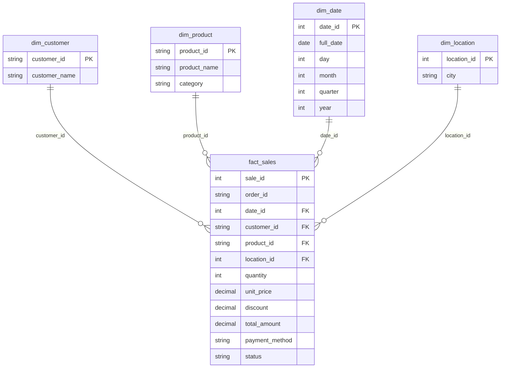

# Kiến trúc của project

## 1. Bức tranh tổng thể

```
 ┌───────────┐   ┌──────────────┐   ┌──────────────────┐   ┌────────────────────┐
 │  CSV file │──►│ Python       │──►│ AWS S3 (raw/)    │──►│ Python ETL/Pandas  │
 │ (nguồn)   │   │ Ingestion    │   │ Data Lake - thô  │   │ làm sạch, biến đổi │
 └───────────┘   └──────────────┘   └──────────────────┘   └─────────┬──────────┘
                                                                     │
 ┌──────────────┐   ┌──────────────┐   ┌────────────────────────┐   ▼
 │ Power BI     │◄──│ SQL          │◄──│ PostgreSQL (local)     │◄──┤ AWS S3 (processed/)
 │ Dashboard    │   │ Analytics    │   │ hoặc AWS Redshift      │   │ Data Lake - đã sạch
 └──────────────┘   └──────────────┘   │ (Data Warehouse)       │   └────────────────────
                                        └────────────────────────┘
```

Dữ liệu chỉ đi **một chiều** từ trái sang phải. Mỗi khối làm đúng một việc và giao kết quả cho khối kế tiếp.

## 2. Giải thích từng khối

| Thuật ngữ | Nghĩa là gì | Trong project này |
|---|---|---|
| **Data Source** (nguồn dữ liệu) | Nơi dữ liệu *sinh ra*: app, website, cảm biến, file Excel/CSV, API... | File `data/raw/orders.csv` do `generate_data.py` tạo, đóng vai trò "hệ thống bán hàng xuất ra file đơn hàng". |
| **Data Ingestion** (nạp dữ liệu vào) | Quá trình *lấy dữ liệu từ nguồn và đưa vào hệ thống phân tích*, chưa sửa gì. | `ingest.py` đọc CSV và upload nguyên vẹn lên S3. |
| **Data Lake** (hồ dữ liệu) | Kho chứa **mọi loại dữ liệu ở dạng nguyên bản**, rẻ, không cần cấu trúc bảng. | Bucket S3. Nó có 2 vùng: `raw/` và `processed/`. |
| **Raw Data** (dữ liệu thô) | Dữ liệu **giữ nguyên như nguồn gửi tới**, kể cả bẩn. Không bao giờ sửa/xoá. | `s3://bucket/raw/orders.csv`. Vì còn bản thô nên nếu code làm sạch sai, ta chạy lại được từ đầu. |
| **ETL** (Extract – Transform – Load) | **E**xtract: lấy dữ liệu ra. **T**ransform: làm sạch, chuẩn hoá, tính toán. **L**oad: nạp vào nơi đích. | `transform.py` (đọc raw từ S3, làm sạch bằng Pandas, lưu processed) và `load.py` (nạp vào database). |
| **Processed Data** | Dữ liệu **đã làm sạch**, đáng tin để phân tích. | `s3://bucket/processed/orders_clean.csv` |
| **Data Warehouse** (kho dữ liệu) | Database **thiết kế riêng cho phân tích** (đọc/tổng hợp nhiều), khác database của app (ghi từng dòng nhanh). Dữ liệu được tổ chức theo mô hình như Star Schema. | PostgreSQL (học ở local) → Amazon Redshift (cloud). |
| **Analytics Layer** (tầng phân tích) | Lớp câu lệnh SQL biến bảng dữ liệu thành *con số kinh doanh*: doanh thu, top sản phẩm, tăng trưởng... | `sql/analytics.sql` (15 truy vấn). |
| **Dashboard** | Trang biểu đồ trực quan để người *không biết SQL* cũng xem được số liệu. | Báo cáo Power BI (4 trang). |

> **Vì sao tách `raw/` và `processed/`?** Nguyên tắc vàng của data engineering: *không bao giờ ghi đè dữ liệu gốc*. Nếu hôm nay bạn phát hiện quy tắc làm sạch sai, chỉ cần sửa `transform.py` và chạy lại từ `raw/`.

## 3. Cấu trúc bucket S3

```
s3://cloud-data-pipeline-yourname-2026/
├── raw/
│   └── orders.csv            ← dữ liệu thô (còn trùng, thiếu, sai)
└── processed/
    └── orders_clean.csv      ← dữ liệu đã sạch + cột total_amount
```

S3 thực ra **không có thư mục**. `raw/orders.csv` là *một cái tên* (gọi là *key*) chứa dấu `/`. Giao diện AWS chỉ trình bày phần `raw/` như một thư mục cho dễ nhìn. Vì vậy bạn không cần tạo thư mục trước: khi upload key `raw/orders.csv`, S3 tự "có" thư mục `raw/`.

## 4. Hành trình của dữ liệu (ví dụ có thật)

Cùng một đơn hàng đi qua pipeline:

**Bước 1 – Raw (đọc từ S3), đơn `ORD000065`:**

```
order_id   category     quantity unit_price discount status     city
ORD000065  electronics  2        18000000   0.00     Completed  Ha Noi
```

Category bị viết thường (`electronics`) - dữ liệu nguồn không thống nhất.

**Bước 2 – Sau `transform.py`:**

```
order_id   category     quantity unit_price discount status     city    total_amount
ORD000065  Electronics  2        18000000   0.0      Completed  Ha Noi  36000000.0
```

- `category` được chuẩn hoá thành `Electronics`.
- `total_amount = 2 × 18.000.000 × (1 − 0.0) = 36.000.000`.

**Bước 3 – Trong PostgreSQL / Redshift:** dòng này nằm trong bảng `orders` *và* được tách ra Star Schema:

```
fact_sales:   sale_id=60, order_id=ORD000065, date_id=20260405, customer_id=CUS00474,
              product_id=P003, location_id=4, quantity=2, total_amount=36000000, status=Completed
dim_date:     20260405 → 2026-04-05, day=5, month=4, quarter=2, year=2026
dim_product:  P003 → Samsung Galaxy S24, Electronics
dim_location: 4 → Ha Noi
```

**Bước 4 – SQL / Power BI:** đơn này góp 36.000.000 VND vào "Revenue by month = tháng 4", "Revenue by category = Electronics", "Revenue by city = Ha Noi".

Ba loại dòng khác trong dữ liệu mẫu và cách pipeline xử lý:

| Dòng raw | Xử lý | Kết quả |
|---|---|---|
| `ORD000019` thiếu `category` (sản phẩm P013 Lipstick) | Điền từ các dòng khác có cùng `product_id` | `Beauty` |
| `ORD000085` có `quantity = -5` | Không hợp lệ, không sửa được | Ghi vào `orders_rejected.csv` với `reject_reason = invalid_quantity` |
| `ORD000108` xuất hiện 2 lần y hệt | Giữ 1 bản | Bản thứ hai bị bỏ (tính vào "duplicates removed") |

## 5. Star Schema

**Vấn đề:** bảng phẳng `orders` lặp lại tên sản phẩm, tên thành phố... ở hàng nghìn dòng. Tốn chỗ, và muốn đổi tên một sản phẩm phải sửa rất nhiều dòng.

**Giải pháp – Star Schema:** chia dữ liệu làm hai loại bảng.

- **Fact table** (bảng sự kiện): *chứa số đo* (quantity, total_amount...) và các khoá trỏ sang bảng dimension. Rất nhiều dòng, mỗi dòng = 1 đơn hàng.
- **Dimension table** (bảng chiều): *mô tả* bối cảnh của sự kiện: **ai** (customer), **cái gì** (product), **khi nào** (date), **ở đâu** (location). Ít dòng, ít thay đổi.

Vẽ ra, fact ở giữa và các dimension bao quanh giống ngôi sao, nên gọi là *Star* Schema.



### Quan hệ giữa các bảng

Ký hiệu `||--o{` đọc là **một – nhiều**: một dòng dimension có thể xuất hiện ở *nhiều* dòng fact.

| Dimension | Khoá | Ý nghĩa quan hệ |
|---|---|---|
| `dim_customer` | `customer_id` | 1 khách hàng có thể mua nhiều đơn → nhiều dòng `fact_sales` |
| `dim_product` | `product_id` | 1 sản phẩm được bán trong nhiều đơn |
| `dim_date` | `date_id` (dạng `20260115`) | 1 ngày có nhiều đơn |
| `dim_location` | `location_id` | 1 thành phố có nhiều đơn |

### Những chỗ khác với thiết kế gốc (và lý do)

1. `dim_date.date` → `full_date`: tránh dùng `date` (tên kiểu dữ liệu) làm tên cột.
2. `dim_customer.customer_name` là `'Customer CUS00001'` vì **dữ liệu nguồn không có tên khách**. Ngoài đời thật, tên lấy từ bảng khách hàng của hệ thống bán hàng.
3. `fact_sales` có thêm `order_id`, `payment_method`, `status`. Các câu hỏi *"số đơn hoàn tất / bị huỷ"* và *"doanh thu theo phương thức thanh toán"* cần chúng. (Nếu muốn "sạch" tuyệt đối, có thể tách thành `dim_status`, `dim_payment`; project này giữ đơn giản cho người mới.)
4. `dim_date.date_id` dạng số `YYYYMMDD` (20260115) thay vì đánh số 1, 2, 3... để nhìn vào là biết ngày.

## 6. PostgreSQL local → Redshift

| | PostgreSQL (local) | Amazon Redshift |
|---|---|---|
| Chi phí | Miễn phí | **Tính tiền theo giờ chạy** |
| Loại | Database đa dụng | Data warehouse trên cloud, xử lý song song, tối ưu cho dữ liệu cực lớn |
| Nạp dữ liệu | `INSERT` qua Python (SQLAlchemy) | Lệnh `COPY` đọc thẳng từ S3 |
| Khoá chính | Ép buộc | Chỉ mang tính thông tin, *không ép buộc* |
| Tự tăng | `SERIAL` | `IDENTITY(1,1)` |

Logic SQL (bảng, truy vấn phân tích) **gần như giống hệt**. Vì thế ta học và kiểm thử trọn vẹn pipeline ở local, rồi mới đưa lên cloud khi mọi thứ đã ổn (xem `REDSHIFT_GUIDE.md`).
